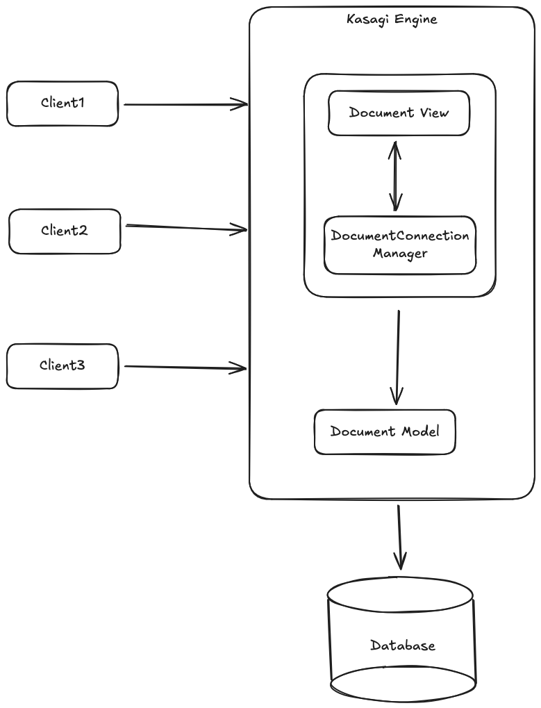

# Kasagi engine

## How to run

* Install python 3.13.5
* Active venv with `source .venv/bin/activate`
* Install packages using `pip install -r requirements.txt`
* Run the commaned `fastapi dev app/main.py`
* Go to `localhost:8000/documents`

## Thought process and architecture decisions

1. Based on the preferred languages and my own experience, I decided to use Python since syntax-wise it is similar to Ruby
2. As for framework, I decided to use FastAPI as it is lightweight and it has great documentation and guides to get started
3. For the database, I decided on SQLite (easiest for prototyping)
4. Due to lack of experience with microservices, actor models, dist. services, I decided to approach this challenge using a monolith
    1. Building using a monolithic approach allowed me to experiment quickly without having to worry about dependencies
5. I decided to make this small app like a mini-Google Doc rather than like a Game World because it was easier to conceptualise
    1. I modeled the documents simply - only having a title and content
    2. I started with just a simple CRUD application to update the documents
6. Real-time connection:
    1. Implemented a [WebSocket connection manager](https://fastapi.tiangolo.com/advanced/websockets/?h=websockets#handling-disconnections-and-multiple-clients)
      to handle connections between document sessions.

## Known limitations and trade-offs

1. Monolithic architecture - easy to scale horizontally across several servers, but not practical at large scale as some parts could be underutilised
    1. WebSocket and HTTP server in one server - requires less setup and dependency, but will be run into bottlenecks as number of users increase.  
      Bottlenecks can either occur with too many websocket connections, or too many concurrent updates.
2. WebSocket - does not support audio or video, but for this simplified application I didn't see it as a problem
